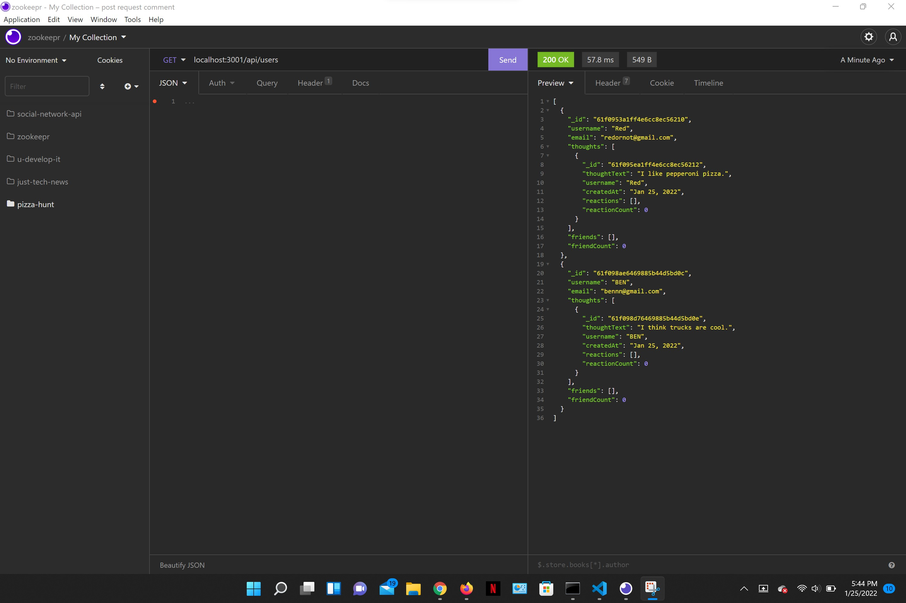

# Social Network API

This Social Network API app allows users to create, update, and delete thoughts. Reacting to the thoughts of other people is possible too, and you can create a list of friends. Express, Mongoose, MongoDB, and Node.js are all used in this program.

## Installation

To install, users must clone the repo. Once all files are on your PC, go to git bash terminal and proceed to input "npm init" --y, then "npm install." To start the app, input "npm start," then use Insomnia to interact with the api routes.

## Screenshot

## Links

Repo: https://github.com/arios10/social-network-api.git

## My Github

https://github.com/arios10/